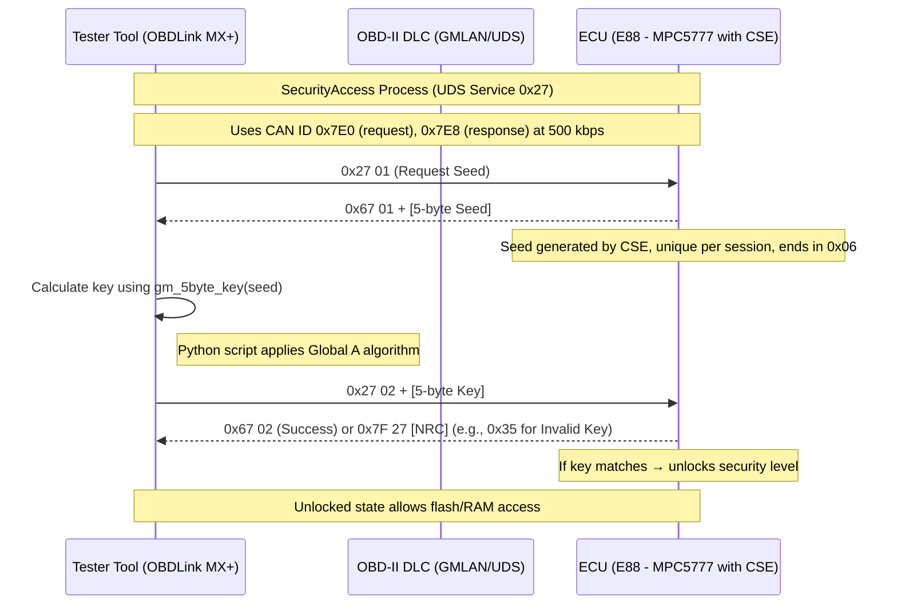

# ECM-seedkey-decoder

>This decoder tool implements the SecurityAccess seed/key decoding process for GM Global A ECMs (e.g., `Delco E88`), transforming a 5-byte seed into a 5-byte key using the **Global A** algorithm. It applies hardcoded arithmetic and bitwise operations to replicate the key calculation for unlocking the ECM via UDS Service `0x27`. Designed for use with diagnostic tools like **OBDLink MX+** and custom CAN code, it enables advanced diagnostic and research purposes, such as ECM reprogramming or tuning, without requiring OEM software or `STGTERM.dat`.

---
>[!CAUTION]
>>Sending incorrect keys to the E88 ECM using send_key.py may trigger a lockout (NRC `0x36`) after 3–5 failed attempts, preventing further tries for 10 seconds to 10 minutes. To avoid this, test only one key at a time, validate `decoder.py`’s algorithm (`ID 93`) with PCMHammer or community resources first, and have a power cycle plan (ignition off for 10 minutes) ready if lockout occurs. Always ensure the OBDLink MX+ is properly connected and the vehicle’s ignition is ON to prevent communication errors.

---



---

| **Field**            | **Details**                                                                 |
|----------------------|------------------------------------------------------------------------------|
| **Target ECU**       | Delco E88 (GM Global A)                                                      |
| **Protocol**         | UDS on GMLAN (CAN 500 kbps), Service `0x27` (SecurityAccess)                 |
| **Seed Format**      | 5-byte, ends in `0x06`, unique per session                                   |
| **Key Derivation**   | Algorithm ID `93` (default), swappable via `stgterm_clean.bin` extract       |
| **Toolchain**        | Python 3.x, `python-can`, `pyserial`, OBDLink MX+, slcan                     |
| **Usage Flow**       | Request Seed → Decode → Send Key → Verify                                    |
| **Lockout Handling** | NRC `0x36` after 3–5 bad keys → wait 10s–10m or power cycle                  |
| **Verification Tool**| PCMHammer (logs seed/key pairs for confirmation)                             |
| **Reverse Option**   | 256 algorithms in `stgterm_clean.bin` → extract via `rebuild_stgterm.py`     |
| **Output State**     | `0x67 02` = Success → unlocks flash/RAM access   

---

## Step 1. Connect `OBDLink mx+` via OBD2 Port

* Plug the OBDLink MX+ into the vehicle’s OBD-II port (under the dashboard, near the steering column).
* Turn the vehicle’s ignition to ON (engine OFF) to power the ECM.
* Pair the OBDLink MX+ with Arch Linux via Bluetooth or USB.

*For Bluetooth, enable pairing mode on OBDLink MX+ (refer to OBDLink manual).
For USB, connect directly.*

---

## Step 2. Verify the CAN channel:
```bash
bashdmesg | grep slcan
ls /dev/serial/by-id
```
Look for `slcan0 (Bluetooth)` or `/dev/ttyACM0//dev/ttyUSB0 (USB)`. Note the channel name `(default: slcan0)`.

---

## Step 3: Install Dependencies
Install codebase:
```bash
git clone https://github.com/malibuw/ECM-seedkey-decoder.git
```

```bash
cd ECM-seedkey-decoder
```
Activate your virtual environment:
```bash
python -m venv venv
```

```bash
source venv/bin/activate
```

Install required Python packages:
```bash
pip install python-can pyserial
```
Verify installations:
```bash
pip show python-can
pip show pyserial
```

---

## Step 4. Calculate Key 
Run the script:
```bash
python3 get_seed.py --can-channel slcan0
```
*Replace `slcan0` with your device’s channel (e.g., `/dev/ttyACM0` if USB).*

Example output:
```text
Connected to CAN bus on slcan0
Extended diagnostic session started.
Seed: 0xA3A3859E06
Retrieved seed: 0xA3A3859E06
CAN bus shutdown.
```

Note the seed (`e.g., 0xA3A3859E06`).

---

## Step 5. Send the Key:
Put in the key obtained from step 4 into `<key>`
```bash
python3 send_key.py --key <key> --can-channel slcan0
```
Replace `slcan0` with your device’s channel if needed.

Example output (success):
```text
Connected to CAN bus on slcan0
Extended diagnostic session started.
ECM Unlocked! Algorithm is correct.
Key 0x1D1E82E706 unlocked the ECM.
CAN bus shutdown.
```
Example output (failure):
```text
Invalid Key (NRC 0x35). Algorithm may be incorrect.
Key 0x1D1E82E706 failed.
CAN bus shutdown.
```

---

## Step 6: Handle Lockout (If Occurs)

If output shows Lockout `(NRC 0x36)`:

Wait 10 seconds: `sleep 10`

Retry `send_key.py` or power cycle the ECM:

*Turn ignition OFF.
Wait 10 minutes.
Turn ignition ON and repeat Step 5.
And/or disconnect battery for 2 mins and reconnect.*


If output shows Invalid Key `(NRC 0x35)`:

Stop and do not retry immediately.

---

## Step 7: Change Algorithm from `ID 93`
If the key from `decoder.py` fails `(NRC 0x35)`, the ECM may use a different algorithm (not `ID 93`). Use `stgterm_clean.bin` and `rebuild_stgterm.py` to extract and apply another algorithm.
### 7.1: Extract Algorithm from stgterm_clean.bin

Run `rebuild_stgterm.py` to parse `stgterm_clean.bin` and extract the algorithm for a specific `ID (0–255)`:
```bash
python3 rebuild_stgterm.py --alg-id <ID> --output alg_<ID>.py
```
Replace `<ID>` with the desired algorithm ID (e.g., `90`).
This generates a Python file (e.g., `alg_90.py`) with the algorithm’s logic.
Note: `stgterm_clean.bin` contains 256 algorithms (256 bytes each, 65,536 bytes total). `rebuild_stgterm.py` must parse the 256-byte block for the specified ID.

### 7.2: Modify decoder.py

Open `decoder.py` in a text editor 
```bash
nano decoder.py
```
Replace the `gm_5byte_key` function with the logic from `alg_<ID>.py`:

Example (if `alg_90.py` defines a new function):
```python
def gm_5byte_key(seed: int) -> int:
    # Replace with logic from alg_<ID>.py
    seed &= 0xFFFFFFFFFF
    # Example: Different constant or operations
    hi = (seed >> 16) & 0xFFFFFFFF
    lo = seed & 0xFFFF
    key = ((hi << 10) | (hi >> 6)) & 0xFFFFFFFF  # Example change
    key = (key + lo + 0xB7D5) & 0xFFFFFFFF      # Example new constant
    key = ((key << 8) | (seed & 0xFF)) & 0xFFFFFFFFFF
    return key
```

Save `decoder.py`.

### 7.3: Test New Algorithm

Repeat Steps 3–5 with the modified `decoder.py`.
If the key still fails, try another algorithm ID (e.g., `91`, `92`, `etc`.) by repeating 7.1–7.2.
Limit attempts to 3–5 to avoid lockout (`NRC 0x36`).

---

## Install PCMHammer if all fails, to confirm the correct algorithm.

Install PCMHammer:
```bash
git clone https://github.com/LegacyNsfw/PcmHammer.git
```
```bash
cd PcmHammer
```
```bash
dotnet build
```
**Run PCMHammer with logging:**
```bash
dotnet run -- unlock --log
```
Check the log for the seed/key pair (e.g., Seed: `0xA3A3859E06`, Key: `0x1D1E82E706`).
Compare with **decoder.py**:
```bash
python3 decoder.py --seed 0xA3A3859E06
```
If keys match, decoder.py’s algorithm is correct.
If not, the algorithm may be incorrect (not `ID 93`).
